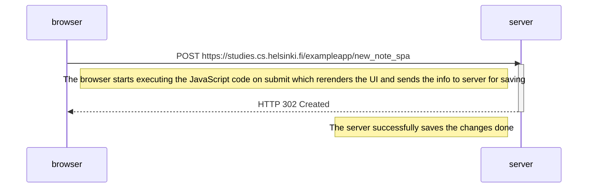

```mermaid
sequenceDiagram
    participant browser
    participant server

    browser->>server: POST https://studies.cs.helsinki.fi/exampleapp/new_note_spa
    activate server
    Note right of browser: The browser starts executing the JavaScript code on submit which rerenders the UI and sends the info to server for saving
    server-->>browser: HTTP 302 Created
    deactivate server
    Note left of server: The server successfully saves the changes done
```